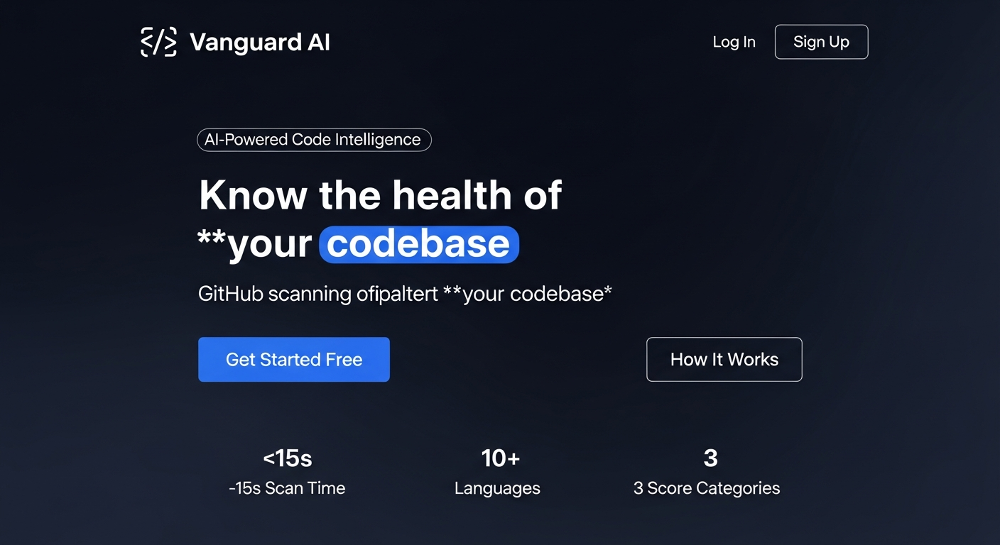
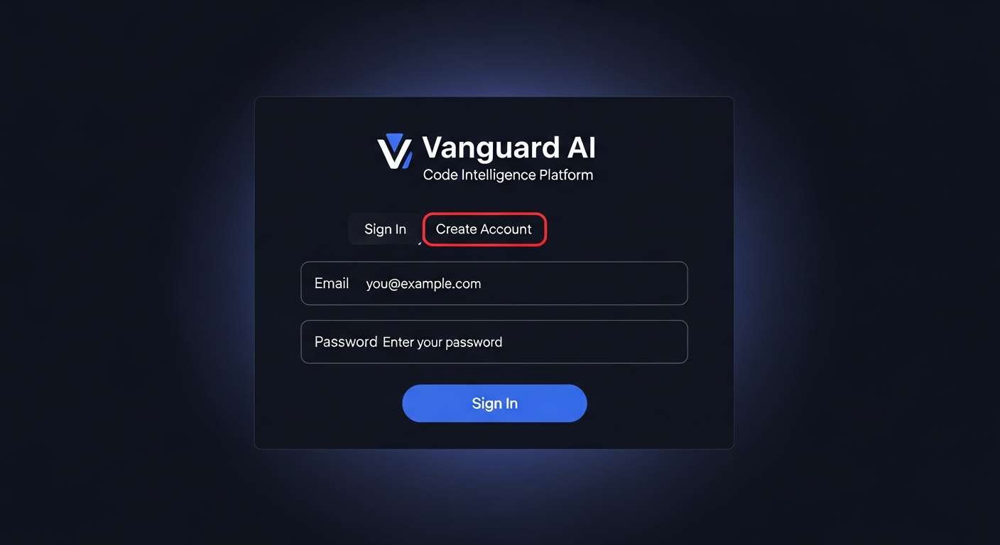
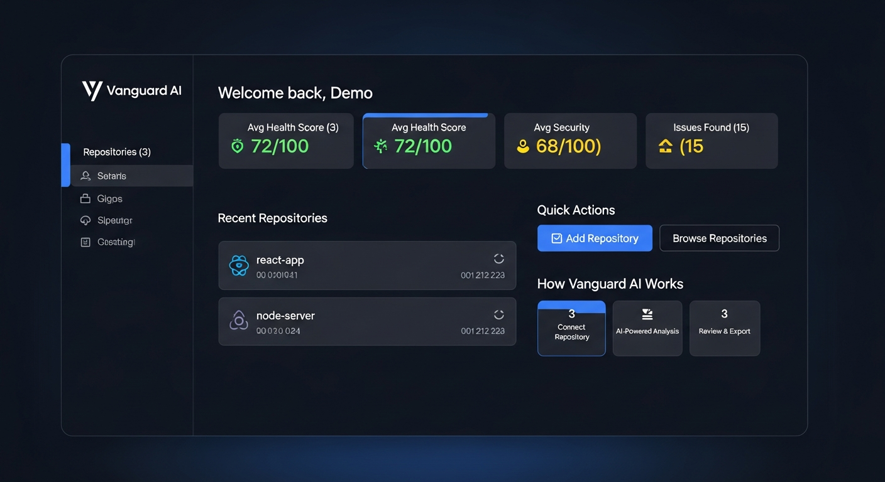
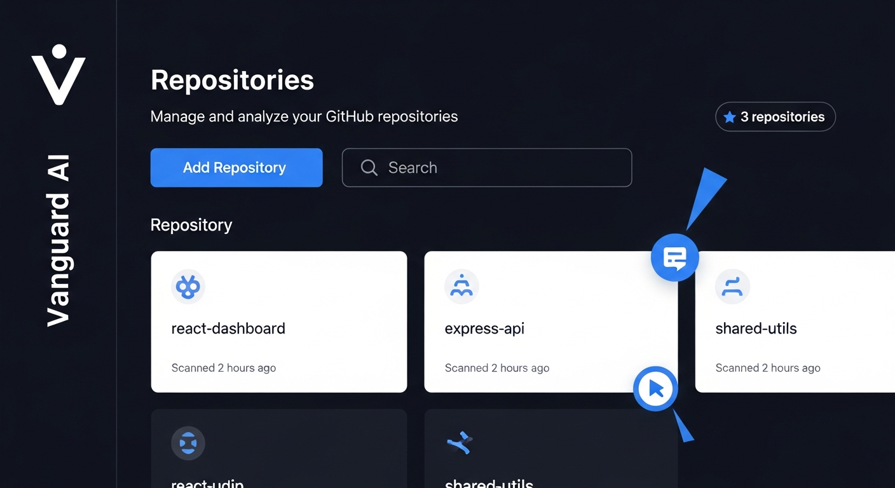
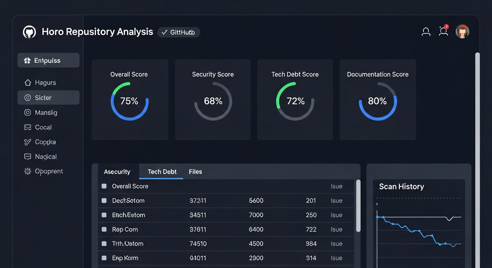
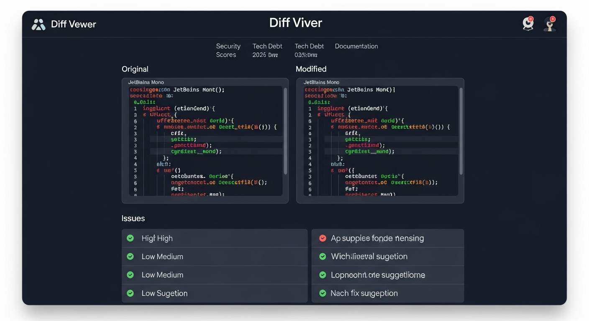

# Vanguard AI - Code Intelligence Platform

## Overview
Vanguard AI is an enterprise-grade code intelligence platform that analyzes public GitHub repositories for code health using AI-powered multi-agent analysis. Users connect repositories, and the system scans source files to evaluate technical debt, security vulnerabilities, and documentation quality. Results are presented through visual dashboards with score rings, charts, and detailed file-level analysis with AI-suggested improvements. Reports can be exported as standalone HTML files.

## Screenshots

### Landing Page
The public-facing landing page introduces Vanguard AI with a hero section, feature highlights, and call-to-action buttons.



### Authentication
Secure email/password authentication with tabbed Sign In and Create Account forms.



### Dashboard
The main dashboard provides a personalized welcome, aggregate statistics across all repositories, recent repository activity, quick actions, and an overview of how Vanguard AI works.



### Repositories
A dedicated page to browse, search, and manage all tracked GitHub repositories with filtering and quick access.



### Repository Analysis
Detailed scan results for each repository showing overall health, security, technical debt, and documentation scores with radial chart visualizations and tabbed exploration.



### Code Diff Viewer
Side-by-side view of original code and AI-suggested improvements with syntax highlighting, file-level scores, and identified issues.



## System Architecture

### Frontend Architecture
- **Framework**: React 18 with TypeScript
- **Routing**: Wouter for client-side routing
- **UI Components**: shadcn/ui component library with Radix UI primitives
- **Styling**: Tailwind CSS with custom dark theme design system
- **State Management**: TanStack Query (React Query) for server state management
- **Build Tool**: Vite for development and production builds
- **Charts**: Recharts for data visualization (radial bar charts, score displays)
- **Code Highlighting**: Prism.js for syntax highlighting in code diffs
- **Animations**: Framer Motion for smooth page transitions and scroll animations
- **Fonts**: Inter (sans-serif) and JetBrains Mono (monospace)

### Backend Architecture
- **Runtime**: Node.js with Express.js framework
- **Language**: TypeScript compiled via tsx (development) and esbuild (production)
- **API Design**: RESTful JSON API under `/api/` prefix with Zod schema validation
- **Session Management**: Express sessions with PostgreSQL storage via connect-pg-simple
- **AI Integration**: Google Gemini API (gemini-2.5-flash) for code analysis
- **GitHub Integration**: GitHub REST API for fetching repository file trees and content
- **Batch Processing**: Concurrency-limited, retry-capable batch processing for AI API calls

### Database Architecture
- **Database**: PostgreSQL with Drizzle ORM
- **Schema Management**: Drizzle Kit for migrations and schema management
- **Tables**: Users, sessions, repositories, scans, file_analyses, conversations, messages

## Key Features

### Authentication System
- **Standalone Auth**: Email/password authentication with bcrypt password hashing
- **Session Storage**: PostgreSQL-backed sessions using connect-pg-simple
- **Security**: Secure HTTP-only cookies, CSRF protection via SameSite policy
- **Route Protection**: Middleware-based authentication guard for all API endpoints

### Repository Management
- **GitHub Integration**: Connect any public GitHub repository via URL
- **File Discovery**: Automatic detection of relevant source code files
- **Repository Dashboard**: Overview of all tracked repositories with health metrics

### AI-Powered Code Analysis
- **Multi-Dimensional Scoring**: Technical debt, security vulnerabilities, and documentation quality scores (0-100)
- **Issue Detection**: Identifies top issues per file with severity ratings and fix suggestions
- **Batch Processing**: Concurrent file analysis with rate limiting and automatic retries
- **Graceful Degradation**: Fallback results when AI analysis encounters errors

### Visual Dashboards
- **Score Rings**: Circular progress indicators for health metrics
- **Aggregate Statistics**: Repository count, average scores, total issues tracked
- **Scan History**: Timeline of analysis runs with status tracking
- **Tabbed Views**: Security, Technical Debt, and Files tabs for detailed exploration

### Code Diff Viewer
- **Side-by-Side View**: Original and AI-suggested code displayed in parallel
- **Syntax Highlighting**: Language-aware code formatting
- **File-Level Analysis**: Individual scores and issues per analyzed file

### Report Export
- **Standalone HTML**: Export scan results as self-contained HTML reports
- **Offline Viewing**: Reports work without any server connection
- **Shareable**: Single-file format for easy distribution

## Data Flow

### Authentication Flow
1. User registers with email and password
2. Password hashed with bcrypt and stored in database
3. Session established with PostgreSQL-backed session store
4. Protected route access granted via session middleware

### Scanning Flow
1. User selects a repository and triggers a scan
2. Server fetches the repository file tree from GitHub API
3. Relevant source files are identified and filtered
4. Files are sent to Google Gemini API for analysis in batches
5. AI returns structured JSON with scores, issues, and suggestions
6. Results are stored in the database and displayed in the UI
7. Auto-polling updates the UI every 3 seconds during processing

### Data Synchronization
- Client queries trigger server API calls via TanStack Query
- Server fetches data from database and external APIs
- Response caching at client level with automatic background refetching
- Optimistic updates for immediate UI feedback

## Architecture Overview

```
User's Browser
    ↓ HTTPS
Application Server
    ↓
Express Server (single process)
    ├── Serves React SPA (static files from dist/public/)
    ├── API Routes (/api/*)
    │   ├── Auth: /api/auth/register, /api/auth/login, /api/auth/logout
    │   ├── Repos: /api/repos (CRUD)
    │   ├── Scans: /api/repos/:id/scans (create, list, get)
    │   ├── Export: /api/scans/:id/export (HTML report)
    │   ├── Stats: /api/stats (dashboard metrics)
    │   └── Health: /api/health (uptime monitoring)
    ├── Google Gemini API (AI code analysis)
    └── PostgreSQL Database
```

## External Dependencies

### Core Dependencies
- **@google/generative-ai**: Google Gemini AI SDK for code analysis
- **drizzle-orm**: Type-safe database ORM and query builder
- **@tanstack/react-query**: Server state management and caching
- **@radix-ui/\***: Accessible UI component primitives
- **express**: Web application framework
- **bcrypt**: Password hashing for authentication
- **connect-pg-simple**: PostgreSQL session storage
- **recharts**: Data visualization charts
- **p-limit / p-retry**: Batch processing with rate limiting

### Development Dependencies
- **vite**: Build tool and development server
- **typescript**: Type checking and compilation
- **tailwindcss**: Utility-first CSS framework
- **drizzle-kit**: Database schema management
- **tsx**: TypeScript execution for development
- **esbuild**: Server bundling for production

## Environment Variables

| Variable | Required | Description |
|---|---|---|
| `DATABASE_URL` | Yes | PostgreSQL connection string |
| `GEMINI_API_KEY` | Yes | Google Gemini API key (free from aistudio.google.com) |
| `SESSION_SECRET` | Yes | Secret for encrypting session cookies |
| `NODE_ENV` | Yes | `development` or `production` |
| `PORT` | No | Server port (defaults to 5000) |

## Deployment

### Development
```bash
npm install
npm run dev
```

### Production Build
```bash
npm run build
npm start
```

### Docker Deployment
The project includes a multi-stage Dockerfile for containerized deployment:
```bash
docker build -t vanguard-ai .
docker run -p 3000:3000 -e DATABASE_URL=... -e GEMINI_API_KEY=... vanguard-ai
```

### Supported Platforms
- **Render.com**: Free tier available with Docker support
- **Railway**: Dockerfile-based deployment with managed PostgreSQL
- **Any Docker host**: Standard container deployment

## Project Structure

```
├── client/                 # React frontend
│   └── src/
│       ├── components/     # UI components (ScoreRing, CodeDiffViewer, Sidebar, etc.)
│       ├── hooks/          # Custom React hooks (useAuth, useScrollAnimation)
│       ├── lib/            # Utilities (queryClient, utils)
│       └── pages/          # Page components (Dashboard, RepoDetails, ScanDetails)
├── server/                 # Express backend
│   ├── lib/                # Core modules (ai.ts, github.ts, github-pages.ts)
│   ├── replit_integrations/# Batch processing and chat modules
│   ├── auth.ts             # Authentication system
│   ├── routes.ts           # API route definitions
│   ├── storage.ts          # Database operations interface
│   └── static.ts           # Static file serving for production
├── shared/                 # Shared code between frontend and backend
│   ├── models/             # Database schema definitions (Drizzle)
│   ├── routes.ts           # API route contracts with Zod schemas
│   └── schema.ts           # Shared type exports
├── Dockerfile              # Multi-stage Docker build
├── railway.toml            # Railway deployment config
└── drizzle.config.ts       # Database migration config
```
